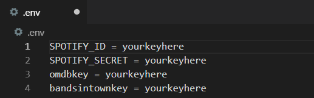
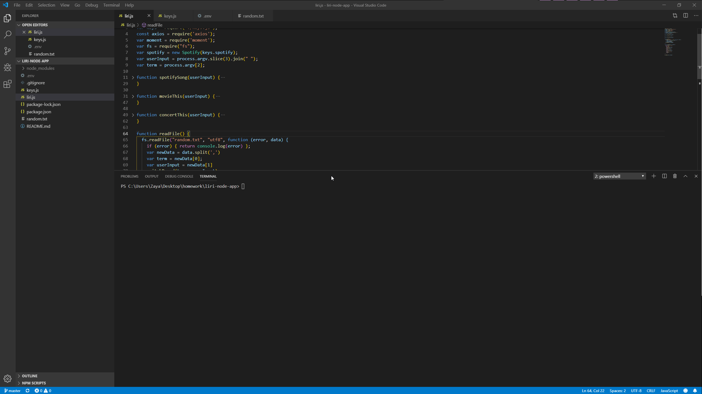
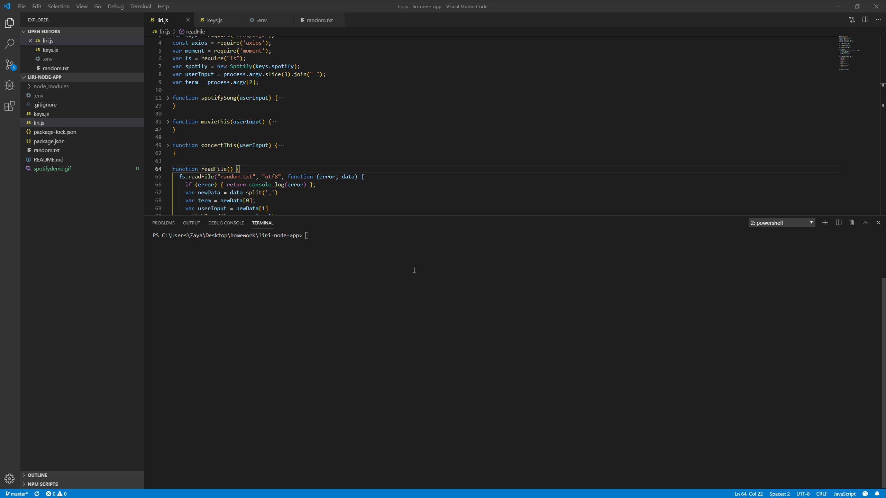
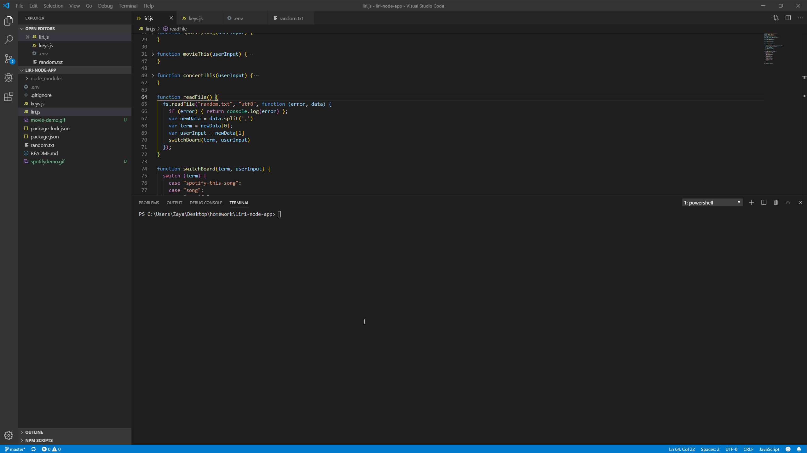
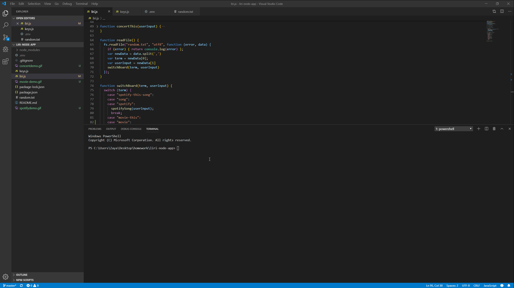
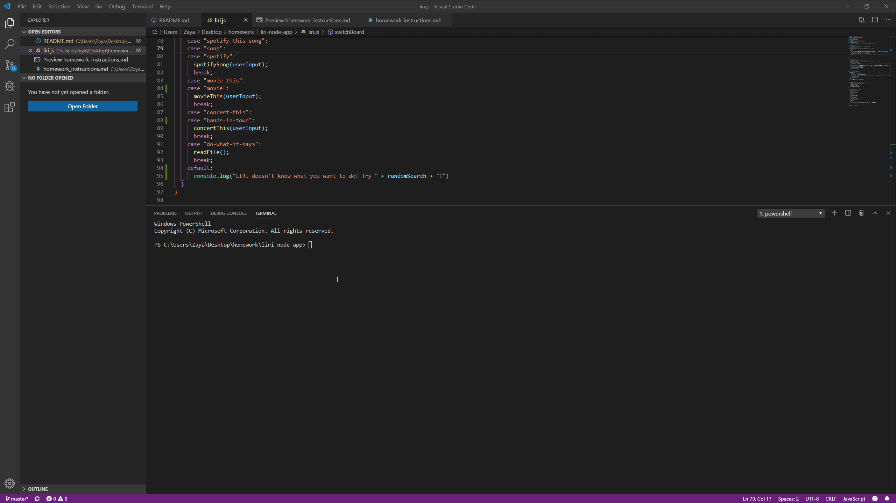

# liri-node-app

LIRI is like SIRI, except much worse! LIRI is like iPhone's SIRI. However, while SIRI is a Speech Interpretation and Recognition Interface, LIRI is a _Language_ Interpretation and Recognition Interface. LIRI will be a command line node app that takes in parameters and gives you back data.

# Using LIRI on your device

In order for you to be able to use LIRI in your terminal, you will need your own API keys along with your own .env file. Inside of your .env is where you will put your keys. Below is a demo of what exactly to do.



## Commands you can run in LIRI

Follow this format to make LIRI work. If you don't, you'll probably get yelled at. Yikes.

node liri.js spotify-this-song *Your input here!*

node liri.js movie-this *Your input here!*

node liri.js concert-this *Your input here!*

node liri.js do-what-it-says

## Introduction

This is a simple node.js app called LIRI, similar to SIRI.
This has to be run in the command line. Won't work anywhere else.
LIRI will take your input and give you back relevant data!
At this time LIRI is capable of these commands only. 

1. spotify-this-song



2. movie-this



3. concert-this



4. do-what-it-says



5. no user input :(



## Outputs

1. `node liri.js spotify-this-song <song name here>`

   * This will show the following information about the song in your terminal/bash window

     * Artist(s)

     * The song's name

     * A preview link of the song from Spotify if there's one available

     * The album that the song is from

   * If no song is provided then your program will default to "Lose Yourself" by Eminem

2. `node liri.js movie-this <movie name here>`

   * This will output the following information to your terminal/bash window:

     ```
       * Title of the movie.
       * Year the movie came out.
       * Country where the movie was produced.
       * Language of the movie.
       * Plot of the movie.
       * Actors in the movie.       
       * IMDB Rating of the movie.
       * Rotten Tomatoes Rating of the movie.
     ```

3. `node liri.js concert-this <artist/band name here>`
     * Name of the venue

     * Venue location

     * Date of the Event 

4. `node liri.js do-what-it-says`

    * Currently this read the random.txt and output information on the default song, "I Want it That Way" by Backstreet Boys.

5. `No User Input`

    * If the user does enter a valid input, it will give examples of working inputs.


